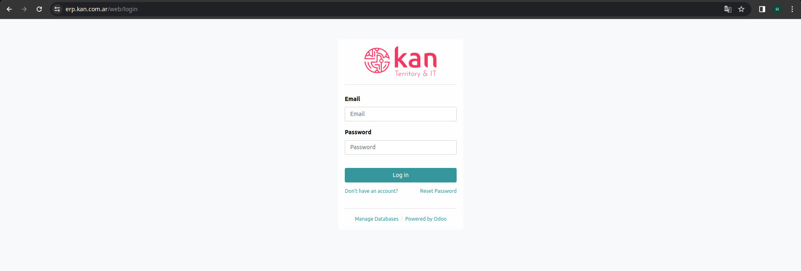
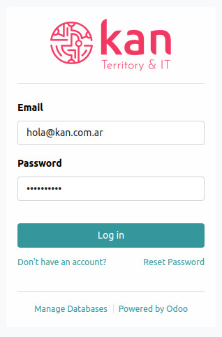
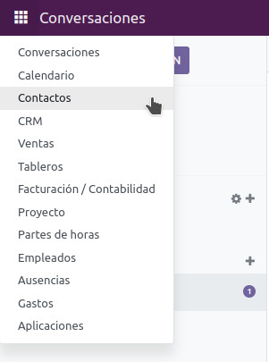
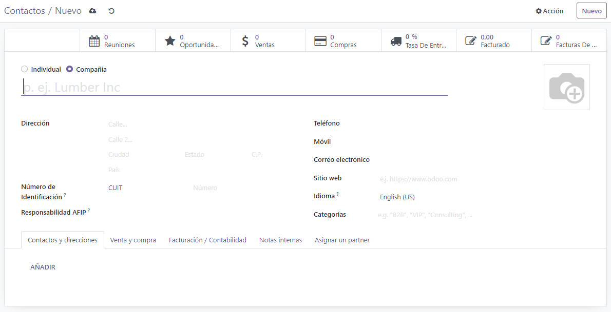
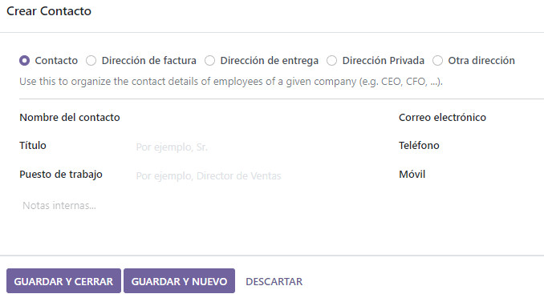
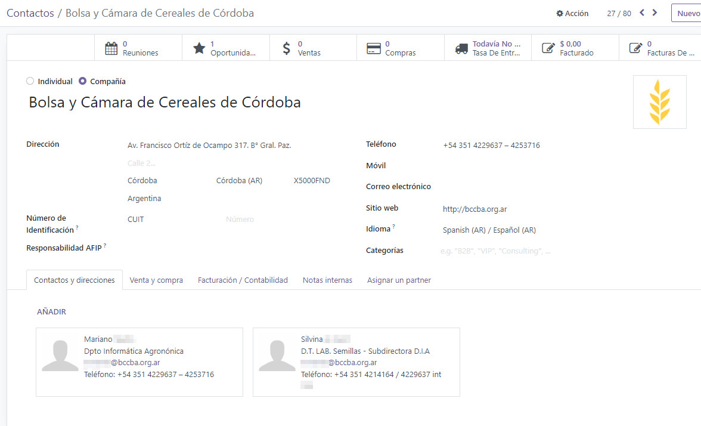
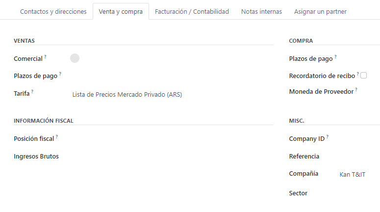
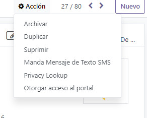

# Introducción

Odoo es un sistema integrado de gestión empresarial (ERP) de código abierto que ofrece una amplia gama de aplicaciones empresariales, desde ventas y CRM hasta contabilidad y recursos humanos. Con una arquitectura modular y una interfaz amigable, Odoo proporciona soluciones flexibles y personalizables para mejorar la eficiencia operativa y la productividad en diversas áreas de una empresa.

Al acceder a [https://erp.kan.com.ar/](https://erp.kan.com.ar/), se mostrará la ventana de inicio de sesión.

A continuación, ingresa tu nombre de usuario y contraseña según corresponda. 

La siguiente pantalla muestra la interfaz de inicio de sesión de Odoo.

# Contactos

El módulo de Contactos en Odoo facilita la gestión eficiente de la información de los clientes y proveedores de una empresa. Permite mantener un registro detallado de contactos, incluidos nombres, detalles de contacto, historial de interacciones y más, lo que resulta fundamental para fortalecer las relaciones comerciales y optimizar la comunicación empresarial.

## Crear Contacto

Ingresamos al módulo de contactos

Luego nos lleva a la siguiente pantalla donde encontraremos un botón ‘**Nuevo**’ para crear un nuevo contacto:

En la siguiente pantalla podremos visualizar todos los datos a relevar y completar para que la tarjeta de contactos sea funcional:

Los datos a completar son:

* Nombre del Cliente
* Dirección
* Teléfono
* Correo Electrónico
* Sitio Web
* Idioma
* CUIT
* Responsabilidad AFIP (Monotributista, RI, Consumidor Final, etc) 

Luego en el apartado de ‘**Contactos y Direcciones**’ añadiremos las personas relacionadas a esta empresa, con las que generalmente tenemos contacto directo.

Así completamos de manera eficiente una tarjeta de contactos, para cuando necesitemos utilizarla para realizar una factura o una oportunidad en el CRM, tengamos la posibilidad de obtener la mayor cantidad de datos posibles.

Luego de completado el cliente en su forma final, quedaría de esta forma:

## Venta y Compra

Por otro lado en la pestaña de ‘**Venta y Compra**’ podemos definir algunos detalles del tipo VENTAS y COMPRA para ese cliente específico como por ejemplo:

* Comercial Asignado a ese cliente
* Plazos de Pago
* Tarifas
* Moneda del Proveedor
* Más Información Fiscal
* Sector a la que se dedica el cliente

## Facturación y Contabilidad

En el apartado de ‘**Facturación/Contabilidad**’ podemos vincular cuentas bancarias del cliente o tipos de documentos (Factura A, B, C, etc)

Si queremos eliminar un contacto, debemos ir al contacto deseado, clickear en el botón de ‘**Acción**’ y eliminarlo o archivarlo en el caso de que queramos que desaparezca temporalmente de nuestra cartera de clientes:

