# Módulo 1: Introducción a GeoNode

## Introducción

En este módulo se realizará un introducción general a la interfaz GeoNode. Sus características, conceptos principales y aplicaciones. Se presentarán además las nociones básicas sobre la administración de Usuarios y perfiles de usuarios.

## ¿Qué es GeoNode?

GeoNode es un sistema de gestión de contenido geoespacial, creado en software libre que permite la creación, intercambio y uso colaborativo de la información. Esta aplicación web permite al usuario cargar datos vectoriales y ráster en sus proyecciones originales utilizando un formulario web.

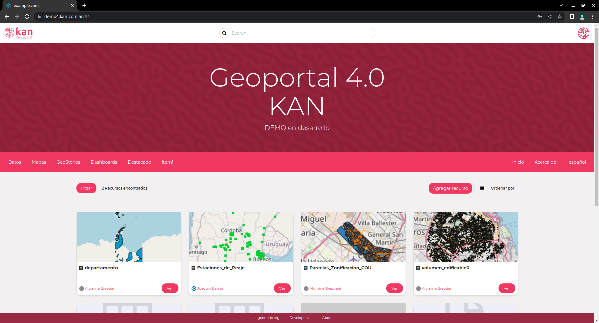

Esta herramienta facilita la gestión de los datos geoespaciales y sus metadatos, así como la visualización de los mismos a través de la creación de mapas. Además, este sistema permite la gestión de la publicación de los grupos de datos, brindando la posibilidad de compartir públicamente o restringir el acceso a la información a usuarios específicos o grupos de usuarios.

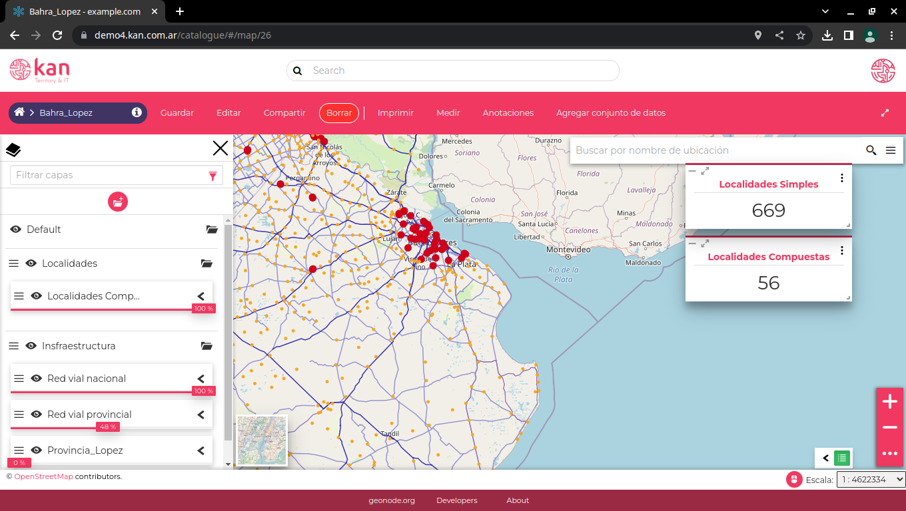

## Conociendo la Interfaz de GeoNode

El ingreso al sistema, se realiza desde el siguiente link:

[https://demo4.kan.com.ar/](https://demo4.kan.com.ar/)

GeoNode permite restringir el acceso a la información contenida y a la gestión de la plataforma.

Se distinguen por default dos tipos de roles de usuarios: usuario y administrador. Cada uno de ellos tiene asociadas distintas funcionalidades.

En la esquina superior derecha se encuentra el botón Ingresar:

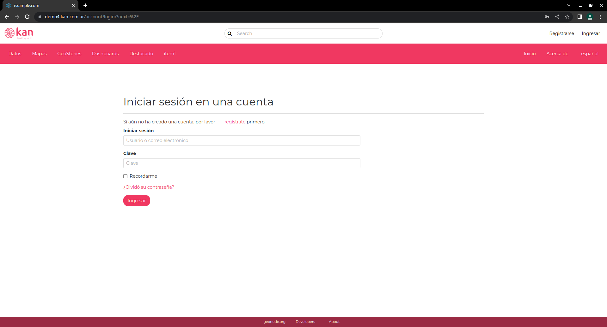

### Descripción de la interfaz administrador

Los principales componentes de la interfaz para un usuario administrador son los siguientes:

* **Datos**: se encuentran los _recursos_  a los que se puede acceder en el Geoportal:_ Datasets, Documentos y Servicios Remotos_.
* **Mapas**: en esta opción se pueden crear, editar y visualizar mapas a partir de las capas de información previamente subidas.
* **GeoStories**: es una herramienta que proporciona al usuario una manera de crear historias mediante la combinación de texto, mapas interactivos y otro contenido multimedia como imágenes y videos u otros contenidos de terceros.
* **Dashboards**: proporciona al usuario un espacio para agregar gran cantidad de Widgets, como gráficos, mapas, tablas, textos y contadores, que le permitan realizar análisis de los datos y capas involucradas.
* **Destacado:** Son Dataset, Documentos y Mapas que aparecen destacados en la página de inicio.

* **Acerca de**: es una de las funcionalidades más importantes dentro del rol administrador, aquí se podrán gestionar las _Personas_ (usuarios) y _Grupos_ asignándoles distintos perfiles para la administración de la información.

Desplegando el menú asociado al nombre de usuario, se accede a las siguientes funciones:

{ align=left }

* **Perfil**: esta función  permite completar y modificar los datos del usuario.
* **Actividad Reciente**: muestra la actividad reciente realizada por los usuarios
* **Favoritos**: muestra los recursos que el usuario marca como relevante.
* **Bandeja de entrada**: mensajes recibidos o enviados a otros usuarios registrados.
* **Administración**: Permite el acceso a la administración de Django.
* **GeoServer**:  desde esta opción se accede al GeoServer.
* **Monitoreo y analítica**: da una visión general del funcionamiento del Geoportal. Muestra errores, alertas, performance del software y del hardware.

Estas tres últimas opciones son exclusivas de un usuario con permiso de administrador.

En la parte superior de la pantalla se puede realizar una búsqueda simple que busca en el título del Dataset, Documento o Mapa.

Para realizar búsquedas más avanzadas, debemos usar el botón **Filtrar** que se encuentra debajo de **Datos**.

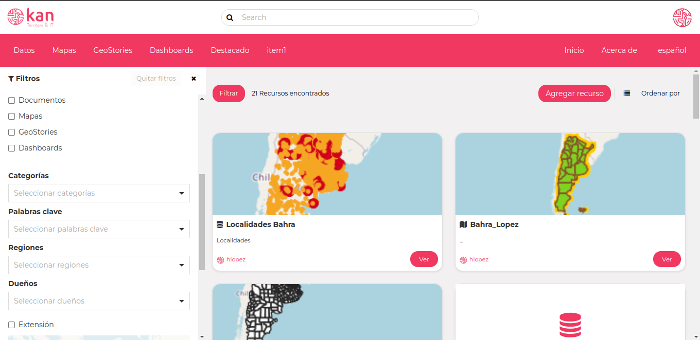

Aquí podemos filtrar si deseamos ver recursos propios, por tipo de datos, si son Documentos o mapas, pero además podremos buscar por Categorías, Palabras clave, Regiones o por Usuario.

Por último, si el usuario tiene permisos para editar, tenemos a la derecha el botón Agregar recurso, donde podremos subir Datasets, cargar Documentos y crear Mapas, GeoStories, Dashboards, Conjuntos de datos y Agregar Servicio Remoto.

### Descripción de la interfaz usuario

Los componentes de la interfaz de usuario estarán determinados por el tipo de perfil que el usuario tenga.

En este taller, se propone un perfil de usuario con el permiso para la carga y edición de capas y mapas.

Por lo tanto, dispondrá de los mismos componentes que ya vimos. La diferenciación del perfil administrador, se encuentra en el menú **Acerca de**, donde solo se verá **Personas**, **Grupos** e **Invitar usuarios** y en el menú asociado al nombre de usuario, donde se accede a las siguientes funciones: **Perfil**, **Actividad reciente**, **Favoritos** y **Bandeja de entrada**.

## Administración de cuentas y perfiles de usuarios

GeoNode es principalmente una plataforma social, por lo cual, un componente principal de cualquier instancia de esta herramienta es la cuenta de usuario.

En GeoNode, muchos contenidos son públicos, por esta razón, los usuarios no registrados tienen acceso de solo lectura a mapas, capas y documentos públicos.

Para crear mapas, agregar capas o documentos, editar los datos y compartir estos recursos o para restringir el acceso a la información, se debe realizar una gestión del perfil de usuario para la asignación o restricción de permisos de acceso y edición de la información.

### Creación de usuario

{ align=right }

La creación de un usuario nuevo es una funcionalidad específica del rol **administrador**.

Para ello, se debe seleccionar la opción **Acerca del** menú y al desplegarlo, aparecerá la opción **Agregar Usuario**.

Puede suceder, que en algunos casos GeoNode esté configurado de tal manera que no se tenga la opción de** Agregar Usuario** en el menú. En estas situaciones, otra forma de acceder al menú de creación de  usuarios es a través de la opción **Administración**, desplegando el menú debajo del nombre de usuario. Dentro de la **Administración de Django**, desplazándose hacia abajo hasta encontrar la opción **Personas**, se selecciona **Usuarios**.

Al ingresar, se accede al listado de usuarios, que también permite la edición de los mismos. Para agregar un nuevo usuario se selecciona la funcionalidad **Añadir Usuario.**

Dentro de este formulario se podrá crear un nuevo usuario con un _nombre_ y _contraseña_. Luego de completar estos datos, GeoNode proporciona tres opciones de guardado: **Grabar y continuar editando**, **Grabar y añadir otro** o **Guardar**.

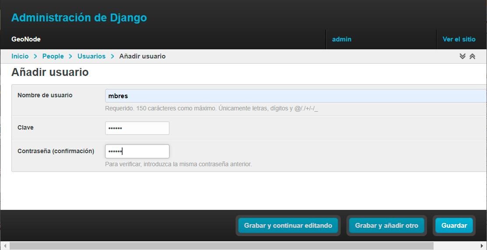

Luego, GeoNode permite la carga de información asociada al usuario a través del siguiente formulario.

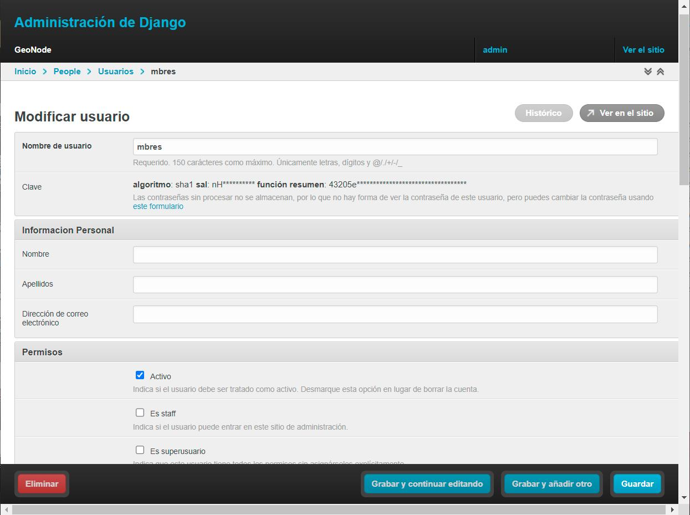

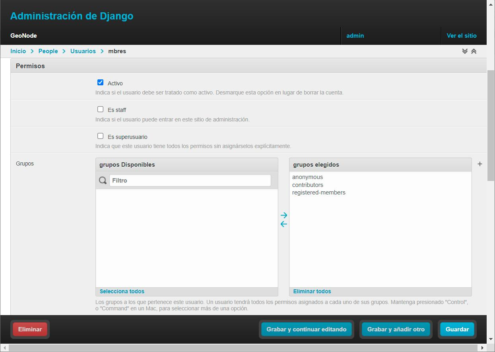

Al crear los usuarios se debe tener bien claro cuales son los permisos que se desean otorgarle. GeoNode por defecto lo marca como Activo y le asigna tres grupos: anonymous, contributors y registered-members.

**Activo**: Indica que el usuario debe ser tratado como activo. Se recomienda desmarcar la opción en lugar de borrar la cuenta.

**Es staff**: Indica que el usuario puede entrar al sitio de **Administración**, se recomienda que únicamente esté habilitado para los superusuarios que cumplan las funciones de administrador del sitio.

**Es superusuario**: Indica que este usuario tiene todos los permisos, sin necesidad de tener que asignarselos.

El grupo **Anonymous** permite ver todos los recursos públicos.

El grupo **Registered-members** les da acceso solo a los recursos donde estos tienen permiso.

En el caso del grupo **Contributors** posee el siguiente permiso: **_Base│resource base│Can add resources_**, que permite al usuario agregar agregar servicios remotos y guardar los mapas creados.

Para terminar el formulario, se completan los datos del perfil extendido.

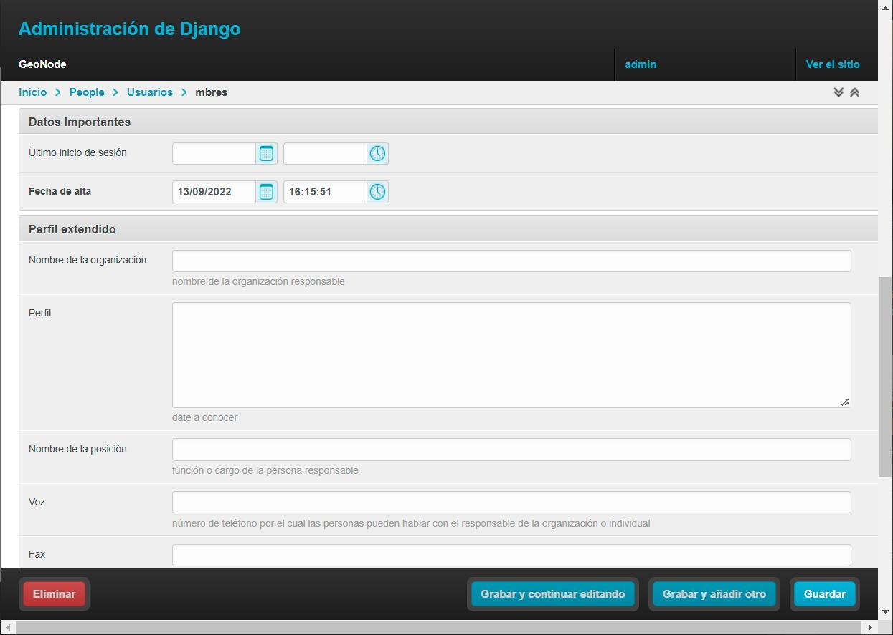

## Gestión de grupo y categorías de grupo

GeoNode permite la creación de grupos de usuarios y categorías de grupos de usuarios, a los que se pueden asignar diversos permisos y/o restricciones. Es de utilidad para agrupar a usuarios que estén trabajando sobre una misma temática o pertenezcan a un mismo grupo de trabajo, institución, etc.

Esta funcionalidad es propia del **rol administrador**, con lo cual se deberá ingresar con este perfil para poder gestionar los grupos y las categorías de grupos.

### Creación de grupos

{ align=right }

En la opción **Acerca de** del menú, se debe seleccionar la opción** Crear grupo**.

Aparecerá en pantalla el formulario correspondiente a la funcionalidad **Crear un grupo**. Allí, el administrador podrá completar el título (nombre de grupo), seleccionar un logo o una imagen representativa, realizar una descripción del grupo, añadir palabras claves que facilitarán la búsqueda del grupo y gestionar el acceso del grupo, además, se podrá asignar una categoría de grupo.

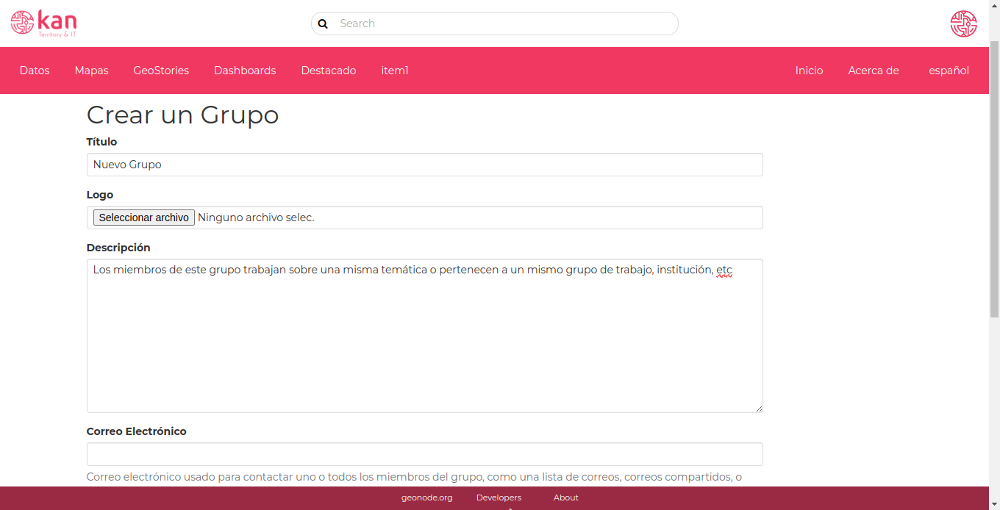

El acceso del grupo tiene tres opciones:

* **Público**: cualquier usuario registrado puede ver y unirse a un grupo público.
* **Público (solo invitación)**: cualquier usuario registrado puede ver el grupo. Solamente usuarios invitados pueden unirse.
* **Privado**: los usuarios registrados no pueden ver ningún detalle acerca del grupo, incluyendo membresía. Solamente usuarios invitados pueden unirse.

La creación del grupo finaliza al clickear sobre el botón **Crear**.

Luego, desde la pantalla del grupo se podrán gestionar los miembros adheridos al mismo.

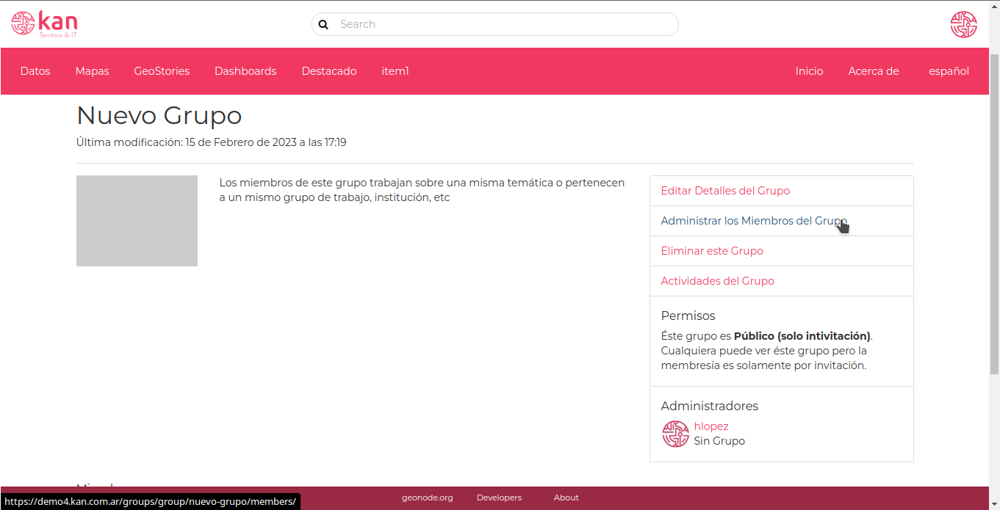

### Categorías de grupo

Desde la opción Administración accedemos a DJango y buscamos la categoría Grupos y Categorías de Grupo.

El _administrador_ podrá crear una categoría de grupo que reúna características en común de diversos grupos. Luego, podrá asignar a esta categorías distintos grupos.

Al hacer clic en **+ Añadir group category**, aparecerá el siguiente formulario en donde se podrán completar los datos de la categoría de grupo:

Luego, se puede asignar al grupo la categoría correspondiente, lo que facilitará su localización.

Desde el menú **Grupos**, ingresamos al grupo que queremos incluir en la **Categoría de grupos** y seleccionamos la opción **Editar Detalles de Grupo** y en **Categorías** aparecerá la categoría creada.

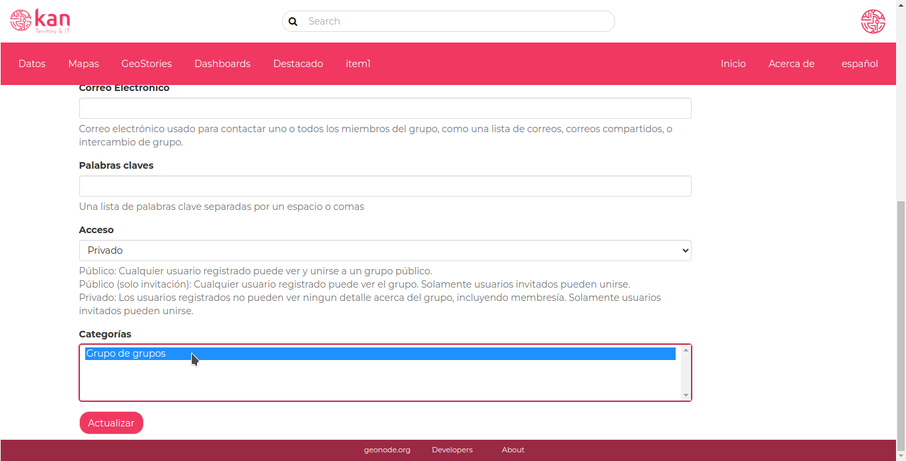

### Permisos de Grupo

Una vez creados los grupos, se le pueden asignar permisos específicos al grupo. Ingresando a la **Administración de Django**, desplazándose hacia **Autenticación y autorización**, se selecciona **Grupos**.

Al acceder a la funcionalidad **Grupos**, aparece el listado de grupos creados en GeoNode.

Cliqueando sobre el nombre del grupo se accede a una ventana donde se podrán otorgar o quitar los permisos.

Para este ejemplo, se seleccionó el grupo contributors, que ya tiene asignado el permiso: **Base│resource base│Can add resources**.

Las flechas **⇄** permiten agregar y quitar los permisos. Luego de establecerlos con el botón **Guardar** se graban los cambios.

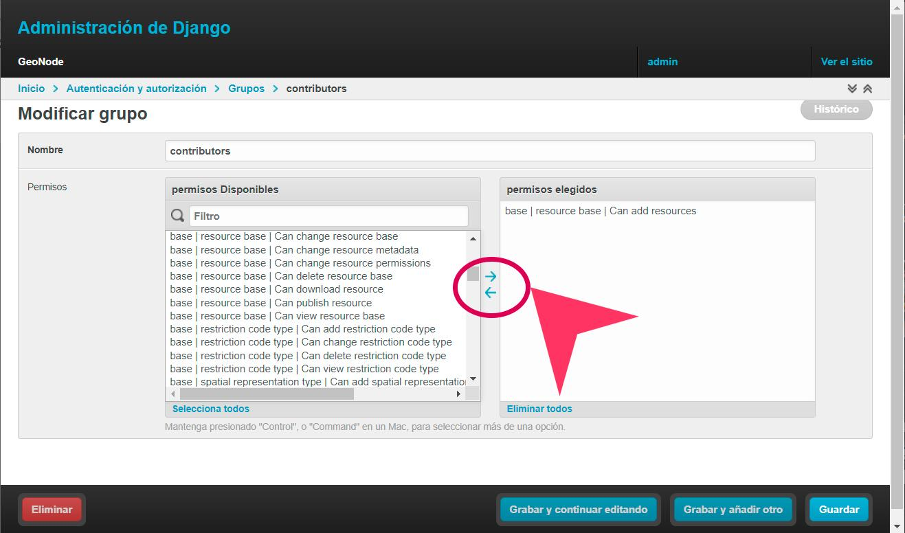

**¡AHORA ESTAMOS LISTOS PARA COMENZAR A EXPLORAR GEONODE!**

## Páginas web

GeoNode User Guide: [https://docs.geonode.org/en/master/usage/index.html](https://docs.geonode.org/en/master/usage/index.html)

Geonode - Sitio oficial: [https://geonode.org/](https://geonode.org/)

Geoexpress - Demo Kan: [https://demo4.kan.com.ar/](https://demo4.kan.com.ar/)
