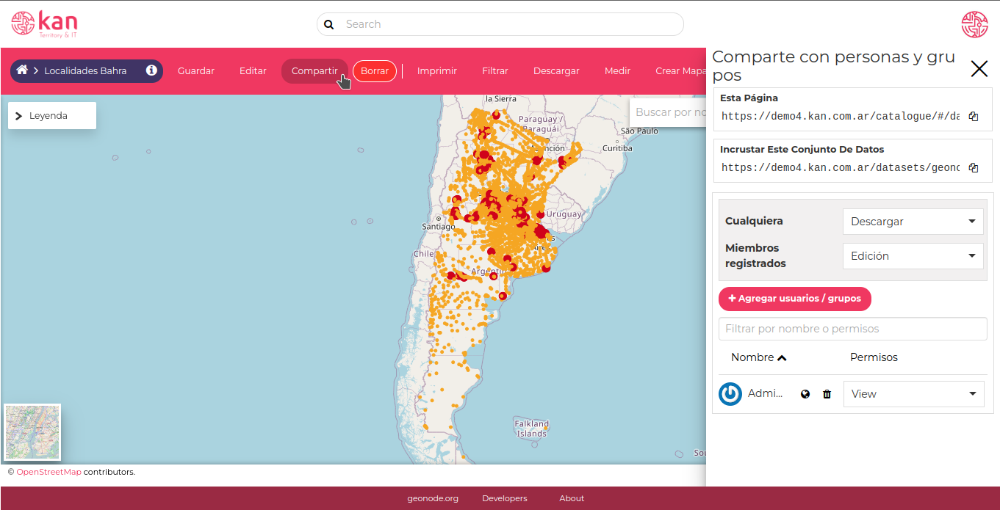

# Módulo 2: Gestión de Datos Espaciales

## Introducción

En este módulo se presentarán las funciones que permiten la Importación y creación de capas y la gestión de sus metadatos.

## Gestión de Datos espaciales

### Datos

GeoNode permite al usuario cargar datos vectoriales y ráster en sus proyecciones originales utilizando un formulario web.

Los datos vectoriales se pueden cargar en formatos diferentes (actualmente shapefile, csv). Las imágenes satelitales y otros tipos de datos raster se pueden cargar como GeoTIFFs.

Los datos vectoriales se convierten en tablas geoespaciales en una base de datos, las imágenes satelitales  y otros tipos de datos ráster se conservan como GeoTIFF.

### Metadatos

Los metadatos contienen toda la información relacionada con el documento. Proporcionan la información esencial para su identificación y comprensión. Los metadatos también hacen que el documento sea más fácilmente recuperable a través de la búsqueda por otros usuarios.

Tan pronto como se finaliza la carga, el usuario puede completar los metadatos del recurso para que estén disponibles a través de los puntos finales y APIs de CSW (OGC Catalog Service).

Los usuarios también pueden cargar un documento XML de metadatos (formato ISO, FGDC y Dublin Core) para completar los elementos clave de metadatos de GeoNode automáticamente.

## Importación y creación de Capas

### Importar capas

Para subir una capa, el usuario debe dirigirse a la opción** Agregar recurso → Subir conjunto de datos**.

A través de la opción **+ Seleccionar archivos...**, el usuario puede seleccionar los  archivos que desea subir, dirigiéndose a la carpeta donde se encuentran los archivos. o bien, puede arrastrar los archivos al recuadro: **Subir un conjunto de datos.**

Es importante verificar que las capas sean archivos de datos de tipo vectorial o ráster válidos. En el caso de una capa de tipo ESRI Shapefile, es necesario incluir todos sus archivos obligatorios (.shp, .shx, .dbf y .prj). Si contiene metadatos, se deberá incluir el archivo .xml. y también de esta misma manera, se puede anexar el estilo en formato SLD, agregando el archivo .sld. Todos estos archivos deben tener el mismo nombre. Tanto los metadatos como los estilos, se pueden subir luego de creada la capa.

A continuación, se selecciona **Subir** para iniciar el proceso o **el icono de papelera** para eliminar los archivos cargados.

Una barra de progreso muestra la operación realizada durante la carga de la capa y alerta cuando el proceso termina u ocurre algún error. También contamos con un botón de cancelar carga en caso que detectemos algún problema. Cuando finaliza el proceso, haciendo clic en el nombre de la capa se puede comprobar que se ha cargado correctamente.

### Crear capas

{ align=right }

GeoNode también brinda la posibilidad de crear una capa desde su interfaz. Para ello, el usuario debe presionar el botón **Agregar recurso → Crear conjunto de datos.**

Para crear una nueva capa, se deben completar los campos _Dataset name, Dataset title y Tipo de geometría_, donde podremos elegir si será una capa de puntos, líneas o polígonos.

A través del botón **Agregar atributo **se agregan los nuevos atributos de la tabla asociada a la capa. Los atributos pueden ser de tipo _String_, _Entero_, _Float_ y _Fecha_.

Una vez rellenado el formulario, se selecciona el botón **Crear**. La nueva Capa se encontrará vacía, hasta que completamos los datos.

### Edición de los datos de una capa

El menú **Editar** contiene las opciones para poder editar un dataset, los datos que la componen, el estilo y los metadatos. También podemos subir un archivo SLD para cambiar el estilo o un archivo con información de Metadatos .

Al seleccionar **Editar Datos** aparecerá automáticamente un panel de edición en la parte inferior del mapa. En este panel se enumeran todos los atributos y hay distintas opciones que nos permiten editar o filtrar los datos de la tabla.

* Edición
* Búsqueda avanzada
* Zoom a la extensión de la página
* Ocultar/mostrar columnas
* Sincronizar mapa con filtro

Para poder editar la capa o agregar registros se presiona el botón de edición.

### Permisos de capas

A través del menú Compartir, además de tener los links para compartir la capa o incrustarla en un sitio web, tenemos acceso a la administración de los permisos del dataset.

Para los usuarios que no están registrados ( **Cualquiera** ), podemos definir si el dataset está oculto ( **Ninguno **), si lo pueden ver ( **View **) o lo pueden **Descargar**. Para los **Miembros Registrados** se puede definir **Ninguno**, **View**, **Descargar**, **Edición**, **Administrar**. Solo el usuario con permisos para editar puede ver el menú de permisos.

También con el botón **+ Agregar usuarios / grupos**, no solo podemos asignar permisos especiales a un usuario, sino que podemos restringir qué zona del mapa puede ver / editar.

Al ingresar con al dataset con este usuario podemos ver el resultado.

Lo mismo que hacemos con usuarios, podemos realizarlo con grupos de usuarios.

## Gestión de Metadatos

### Configuración de metadatos de la capa

Los metadatos de un conjunto de datos se pueden cambiar a través de un formulario de edición de metadatos que incluye cuatro pasos, uno para cada tipo de metadatos considerados, diferenciando si son metadatos obligatorios o metadatos opcionales[^1].

Se puede acceder al formulario de edición de metadatos de la capa, seleccionando **Editar** y luego la opción **Editar Metadatos**.

#### Metadatos Básicos

En el primer paso, el sistema pide que se inserten los siguientes metadatos:

* **Miniatura** de la capa.
* **Título**  de la capa.
* **Resumen**: breve resumen narrativo del contenido de la capa.
* **Tipo de fecha** las fechas de creación/publicación/revisión que definen el período de tiempo cubierto por el conjunto de datos.
* **Categoría** a la que pertenece la capa, la cual está definida por norma[^2].

* **Grupo** de GeoNode al que está vinculada la capa.
* **Palabras clave** serán registradas en GeoNode, para luego ser utilizadas como criterio de búsqueda en el explorador de capas. Esto facilita la búsqueda y localización de las capas.
* **Título Tesauro**

#### Ubicación y licencias

En este paso se deben introducir los siguientes metadatos:

* **Idioma** del conjunto de datos;
* **Licencia**: el tipo de licencia que tiene el conjunto de datos, que puede ser:
    * Not Specified (por defecto)
    * Open Data Commons Open Database License/OSM
    * Public Domain
    * Public Domain / USG
    * Varied / Derived
    * Varied / Original
* **Atribución** del conjunto de datos: autoridad o función asignada, como a un gobernante, asamblea legislativa, delegado o similar.

* **Regiones**, que informa sobre la extensión espacial cubierta por el conjunto de datos. Las extensiones propuestas abarcan las siguientes escalas: mundial, continental, regional y nacional;
* **Data quality statement**: la declaración de calidad de los datos, es la explicación general de cómo se producen los datos.
* **Restricciones**:  limitaciones colocadas al momento del acceso o uso de los datos.
* **Other constraints**: Otras restricciones: no citadas en el apartado anterior.

#### Metadatos opcionales

La información complementaria es:

* **Edición**: se refiere a la versión del recurso.
* **DOI**: si está disponible, esto representa el identificador de objeto digital del recurso.
* **Purpose**: el propósito del conjunto de datos y sus objetivos.
* **Supplemental information**: cualquier información complementaria que pueda proporcionar una mejor comprensión del conjunto de datos subidos.
* **Frecuencia de actualización**:  se refiere al mantenimiento del conjunto de datos.
* **Tipo de representación espacial**.
* Los usuarios que son responsables del conjunto de datos, su propietario, el autor de sus metadatos y el punto de contacto.

#### Atributos del conjunto de datos

En este paso se puede enriquecer los atributos del conjunto de datos con información útil como la siguiente:

* **Etiqueta**: en esta parte del formulario se coloca el Alias del nombre atributo.
* **Descripción** detallada del atributo.
* **Mostrar Orden**: define el orden de visualización
* **Tipo de visualización**: el valor predeterminado es etiqueta, lo que significa que el valor del atributo se representará como texto sin formato. Existe la posibilidad de configurar GeoNode para tratar los valores como diferentes tipos de archivos multimedia. Como ejemplo, si los valores del atributo seleccionado contienen urls de imagen, al seleccionar el tipo Imagen, permitirá a GeoNode representar la imagen directamente al consultar el conjunto de datos desde los mapas. Lo mismo para los tipos VIDEO, AUDIO o IFRAME.
* **Visible**: le permite instruir GeoNode ocultar un atributo.

#### Publicar capa

En GeoNode, cada recurso debe estar publicado para compartirlo con otras personas. En la pestaña Configuración se puede corroborar si el recurso se encuentra publicado.

El recurso **Esta Publicado** cuando la casilla de verificación está tildada. Si además está tildada **Destacado**, el dataset aparecerá en la página de inicio y en la sección Destacado del menú.

### Cargar metadatos

Vamos a explicar cómo descargar metadatos de una capa de Geonode y luego cargarlos nuevamente en otra capa. Esta funcionalidad puede ser útil, cuando se desea recargar los metadatos de una capa, luego de una migración, por alguna razón que requiera esta acción.

GeoNode, admite archivos de metadatos en los siguientes formatos: XML - ISO, FGDC, ebRIM, Dublin Core, pero para este ejemplo vamos a utilizar XML - ISO.

Seleccionamos el botón **Descargar -> Metadatos iso** del menú del **Dataset** del archivo donde queremos cargar el nuevo archivo.

Esta acción habrá guardado el archivo .xml generado. Lo abrimos con un editor de código o de texto plano, y buscamos la primer línea que contenga <gco:CharacterString> de la que copiamos el código identificador del dataset

Abrimos este nuevo archivo con el editor de código, buscamos nuevamente &lt;gco:CharacterString> y pegamos el código identificador reemplazando el que se encuentra en el archivo.

Guardamos el archivo y volvemos al **Dataset** donde queremos subirlo.

Para subir este archivo, se debe ingresar a **Editar -> Subir Metadatos.**

Se abrirá un formulario como el siguiente en donde cargaremos el archivo de metadatos.

**¡AHORA ESTAMOS LISTOS PARA COMENZAR A SUBIR CAPAS EN GEONODE!**

## Páginas web

GeoNode User Guide: [https://docs.geonode.org/en/master/usage/index.html](https://docs.geonode.org/en/master/usage/index.html)

Geonode - Sitio oficial: [https://geonode.org/](https://geonode.org/)

Geonode - Demo Kan: [https://demo4.kan.com.ar/](https://demo4.kan.com.ar/)

<!-- Footnotes themselves at the bottom. -->
## Notas

[^1]: [Ver Anexo: Perfil para Metadatos IDERA](AnexoIdera.md)

[^2]: [Ver Anexo: Perfil para Metadatos IDERA](AnexoIdera.md)
