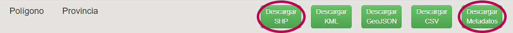

# Administración y Gestión de GeoNode: Módulo II

# Práctico

1. Ingrese al siguiente link : [https://demo4.kan.com.ar/](https://demo4.kan.com.ar/) con el siguiente usuario “capacitacion” y la contraseña: “practica”. Si posee acceso a otro GeoNode, puede realizar la capacitación en él.

2. Descargue de IGN, la capa  provincia y su archivo de metadatos, utilizando el siguiente link:

[https://www.ign.gob.ar/NuestrasActividades/InformacionGeoespacial/CapasSIG](https://www.ign.gob.ar/NuestrasActividades/InformacionGeoespacial/CapasSIG)

3. Modifique el **Título** de la capa con el nombre: Provincia_(su apellido), de esta manera podrá identificar la capa que usted ha subido.

**Editar ->  Editar Metadatos**

4. Deslogueese de GeoNode, luego de seleccionar **Salir **del menú desplegable en la esquina superior derecha donde está su usuario. GeoNode le pedirá que confirme si desea cerrar la sesión. Luego compruebe si la capa recién creada se muestra en GeoNode sin estar logueado.

5. Vuelva a ingresar con su usuario a GeoNode. Explore los permisos para familiarizarse. Modifique los permisos de la capa recién creada **Cualquiera **a **Ninguno**. Luego de realizar este cambio, verifique si la capa se sigue viendo cuando está deslogueado.

6. Utilice el archivo provincia.pdf para completar los metadatos de la capa. No modifique el Título de la capa.
