# Módulo 3: Gestión de Estilos

## Introducción

En este módulo se presentarán las funciones que permiten la Importación, la creación y edición de estilos en GeoNode.

## Gestión de Estilos

### Simbología y etiquetado

Los estilos son símbolos, gradientes de color, formatos de texto o configuraciones de etiquetas que se pueden utilizar para dar simbología a entidades, capas o diseños de impresión. Permiten obtener una comprensión más profunda de los datos al permitir la visualización de diversas formas, lo que puede contar diferentes historias dependiendo de cómo se representan los datos.

De manera similar, GeoNode proporciona un estilizador basado en la web que permite a los usuarios cambiar las representaciones de los datos y obtener una vista previa de los cambios en tiempo real.

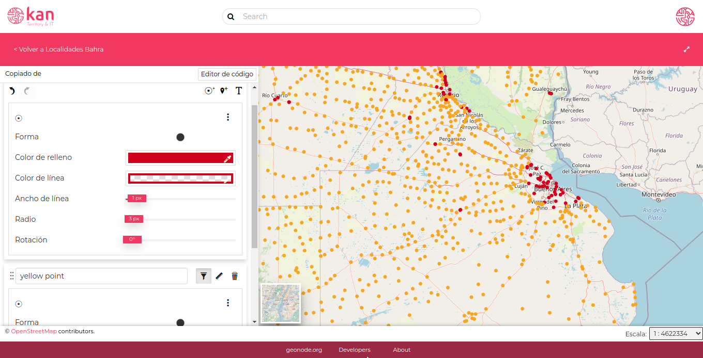

GeoNode asigna un estilo por defecto y brinda la posibilidad de modificarlo, importando un estilo en formato SLD, que sobrescribe el estilo por defecto o modificándolo manualmente desde el portal.

### Cargar estilos

Para cargar o modificar un estilo se debe tener permisos de edición. El permiso de edición lo tiene el usuario que subió la capa y los administradores.

Accedemos al **Dataset** al cual le queremos cambiar el estilo. Presionamos en **Editar -> Subir Estilo**

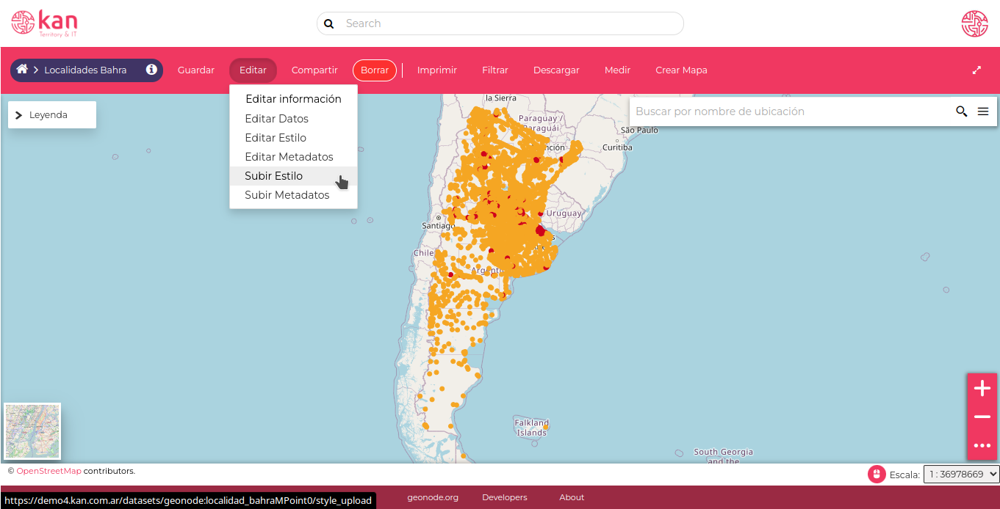

Luego de hacer click en esta opción se ingresa a una interfaz donde  se puede arrastrar el archivo SLD o escogerlo del disco, y además advierte que este archivo va a sobreescribir el estilo predeterminado actual.

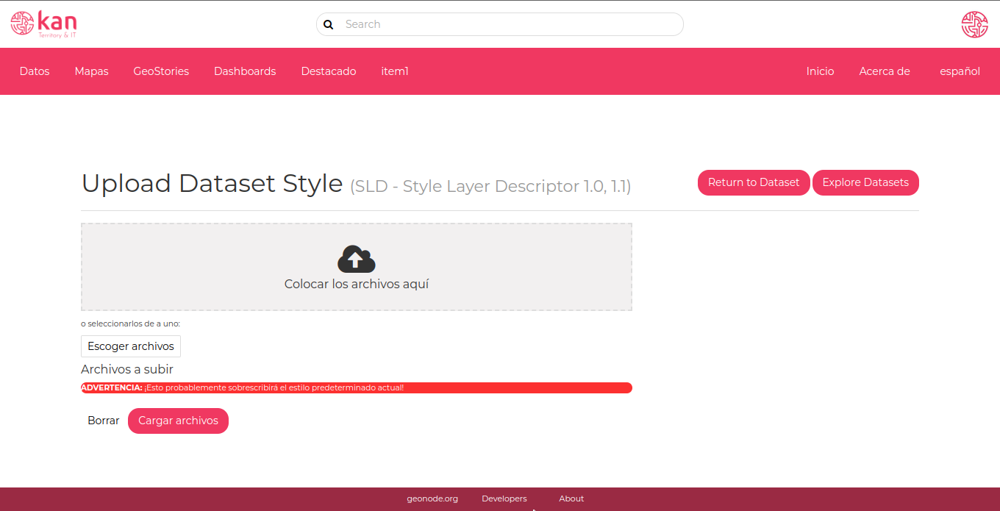

Al volver a la capa se verifican los cambios. En la zona de leyenda aparecerá el nuevo estilo. En algunas ocasiones, para ver los cambios en GeoNode es necesario realizar una recarga de la página que actualice los datos,  utilizando la combinación de teclas: **Ctrl+F5**.

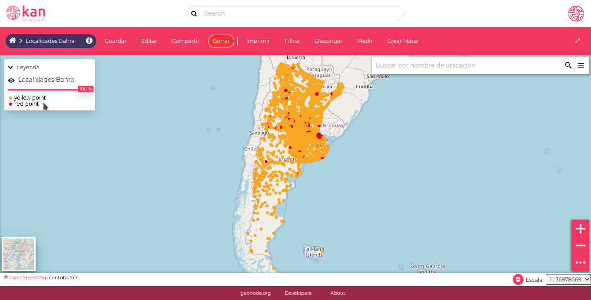

### Crear o editar estilo

Para generar un estilo, se selecciona la opción  **Editar -> Editar Estilo**

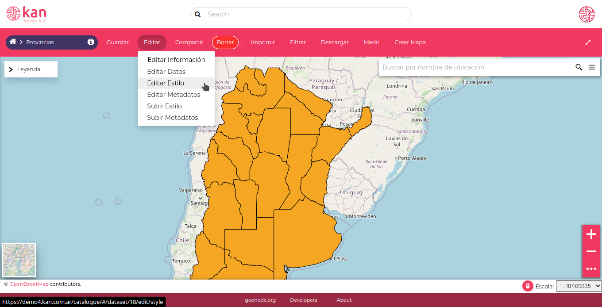

Al ingresar vamos a poder editar el estilo que estamos usando y agregar nuevos estilos.

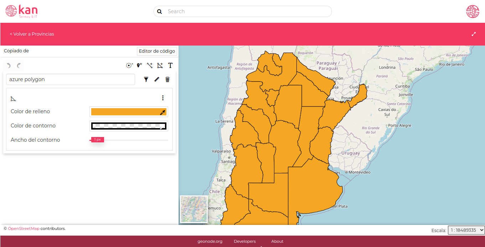

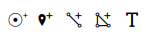{ align=left }

GeoNode brinda una plantilla donde se pueden seleccionar distintos estilos de base, dependiendo del tipo de datos ( Puntos, Iconos, Líneas, Áreas y Textos). Todas estas opciones aparecerán solo si los datos subidos tienen esta información. Si, por ejemplo,  solo es una capa de puntos, tendremos Puntos, Iconos y Texto a editar en el estilo.

Por ejemplo, vamos a cambiar los bordes sólidos de las provincias por bordes punteados. Primero cambiamos el **Ancho del contorno** de 1 px a 0 px de la regla de relleno que estamos utilizando

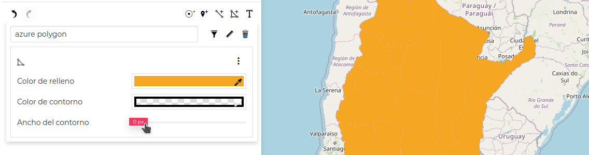

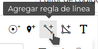{ align=left }

Agregamos una regla de línea, le cambiamos el color y elegimos el Estilo de línea que nos interese y apretamos el botón Aplicar para guardar los cambios. Nos va a quedar el dataset con 2 reglas de estilo.

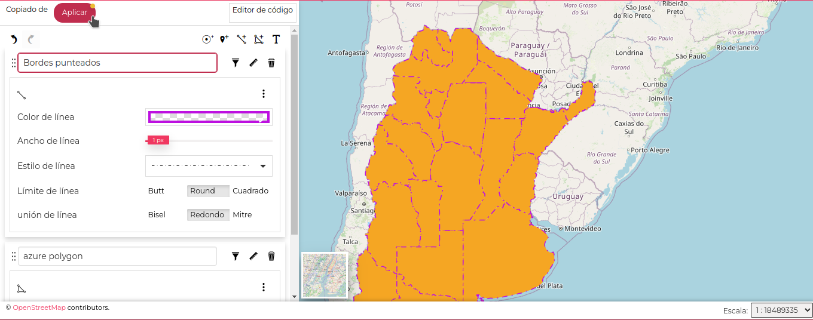

Con el seleccionador de color o de contorno, podemos elegir el color, y la transparencia

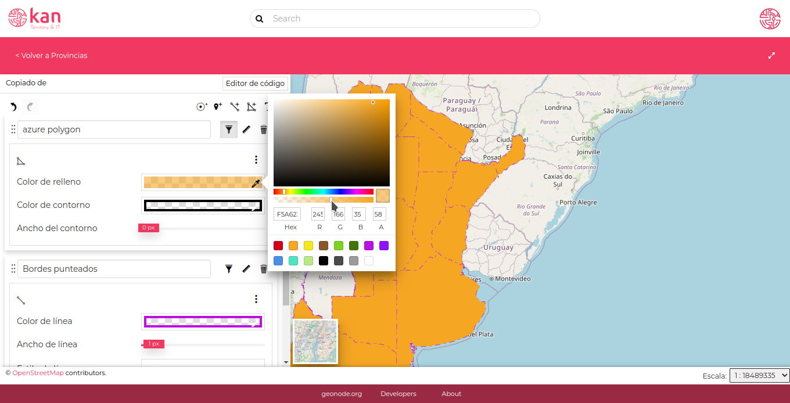

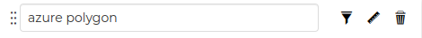{ align=left }

Contamos con 3 botones, un **Generador de filtros**, uno de **Escala** y eliminar el estilo de la capa. Con el **Generador de filtros** podemos modificar el estilo según reglas. Elegimos si se tienen que cumplir alguna o todas las reglas que ajustemos

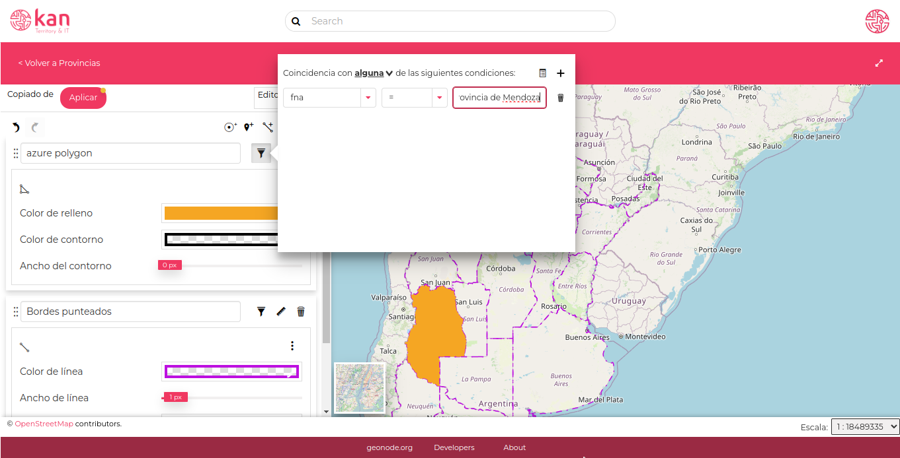

O por el contrario

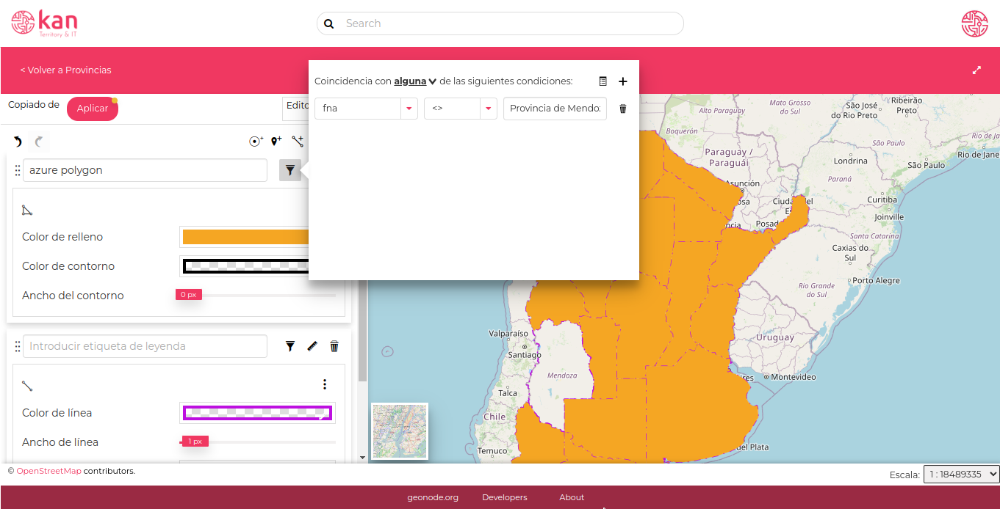

También podemos organizar las capas arrastrando desde los 6 puntos al lado del nombre de la capa. Una vez que terminamos la edición de las capas, apretamos en el botón rojo  **Aplicar**

También contamos con un **Editor de código** donde podemos modificar el estilo a través de línea de comandos. Si subimos un archivo SLD, en forma predeterminada aparece en modo Editor de código, aunque podemos cambiarlo luego al visual.

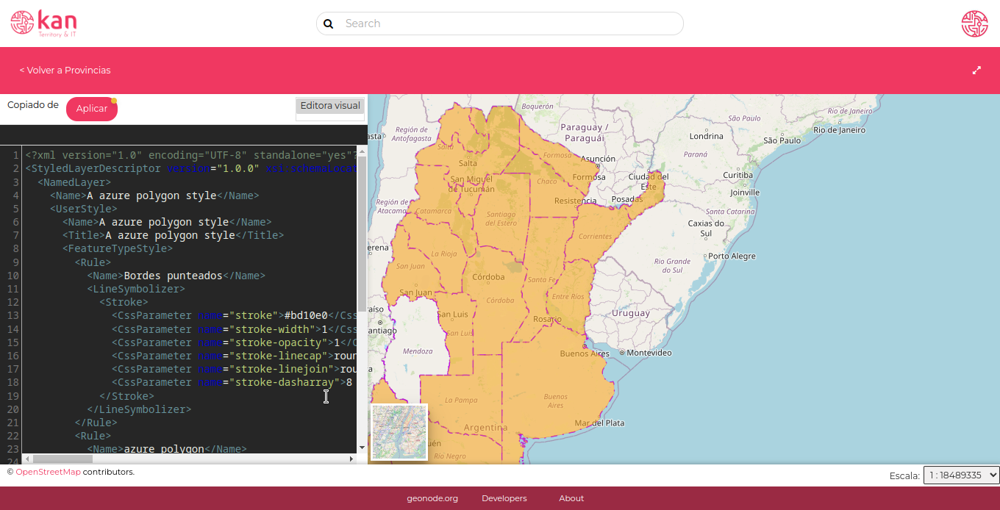

En este caso, podríamos modificar una línea de comando, para que los bordes tengan transparencia:

```
<CssParameter name=<strong>"stroke-width"</strong>><strong>0.5</strong></CssParameter>

```

Ejemplo de código sld:

```
<?xml version="1.0" encoding="UTF-8" standalone="yes"?>
<StyledLayerDescriptor version="1.0.0" xsi:schemaLocation="http://www.opengis.net/sld StyledLayerDescriptor.xsd" xmlns="http://www.opengis.net/sld" xmlns:ogc="http://www.opengis.net/ogc" xmlns:xlink="http://www.w3.org/1999/xlink" xmlns:xsi="http://www.w3.org/2001/XMLSchema-instance">
  <NamedLayer>
    <Name>A azure polygon style</Name>
    <UserStyle>
      <Name>A azure polygon style</Name>
      <Title>A azure polygon style</Title>
      <FeatureTypeStyle>
        <Rule>
          <Name>Bordes punteados</Name>
          <LineSymbolizer>
            <Stroke>
              <CssParameter name="stroke">#bd10e0</CssParameter>
              <CssParameter name="stroke-width">1</CssParameter>
              <CssParameter name="stroke-opacity">1</CssParameter>
              <CssParameter name="stroke-linecap">round</CssParameter>
              <CssParameter name="stroke-linejoin">round</CssParameter>
              <CssParameter name="stroke-dasharray">8 8 1 8</CssParameter>
            </Stroke>
          </LineSymbolizer>
        </Rule>
        <Rule>
          <Name>azure polygon</Name>
          <Filter xmlns="http://www.opengis.net/ogc">
            <Or>
              <PropertyIsNotEqualTo>
                <PropertyName>fna</PropertyName>
                <Literal>Provincia de Mendoza</Literal>
              </PropertyIsNotEqualTo>
            </Or>
          </Filter>
          <PolygonSymbolizer>
            <Fill>
              <CssParameter name="fill">#f5a623</CssParameter>
              <CssParameter name="fill-opacity">1</CssParameter>
            </Fill>
          </PolygonSymbolizer>
        </Rule>
      </FeatureTypeStyle>
    </UserStyle>
  </NamedLayer>
</StyledLayerDescriptor>
```

**¡AHORA ESTAMOS LISTOS PARA COMENZAR A PERSONALIZAR LOS ESTILOS!**

### Páginas web

GeoNode User Guide: [https://docs.geonode.org/en/master/usage/index.html](https://docs.geonode.org/en/master/usage/index.html)

Geonode - Sitio oficial: [https://geonode.org/](https://geonode.org/)

Geonode - Demo Kan: [https://demo4.kan.com.ar/](https://demo4.kan.com.ar/)

SLD Cookbook: [https://docs.geoserver.org/latest/en/user/styling/sld/cookbook/index.html](https://docs.geoserver.org/latest/en/user/styling/sld/cookbook/index.html)
