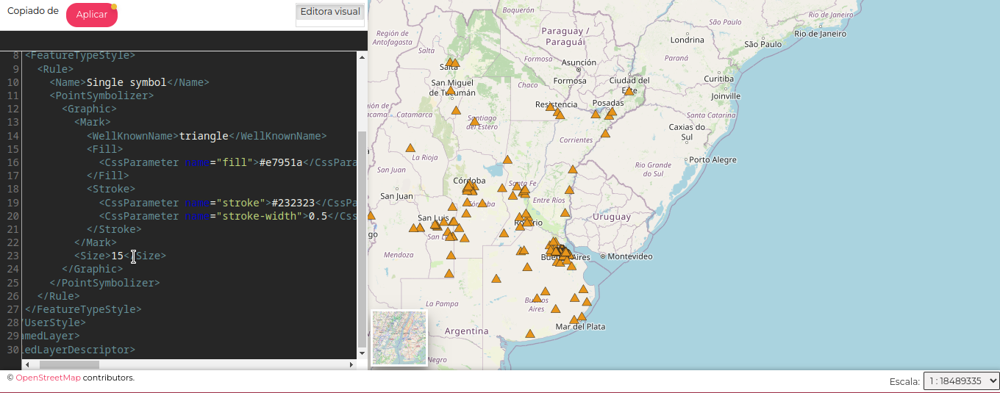
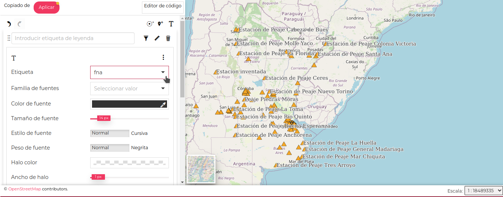

# Administración y Gestión de GeoNode: Módulo III

# Práctico

1. Descargue del Anexo: Anexo - Recursos para Guía Práctica - Módulo 3, el archivo:

[estaciones_de_peaje.zip](files/Anexo - Recursos para Guía Práctica - Módulo 3/estaciones_de_peaje.zip)

2. Importe la capa en GeoNode, pruebe realizarlo utilizando directamente el archivo **.zip** (sin descomprimirlo) y luego de importarla verifique los permisos de la capa: cambie la opción  **Cualquiera** para que solo sea visible para ud a través de **Compartir**.

3. Modifique el **Título** de la capa con el nombre: *Peajes_(su apellido)*, de esta manera podrá identificar la capa que usted ha subido.

**Editar -> Editar Metadatos -> Título**

4. Observe que estilo le otorgó GeoNode por defecto a la capa.  Descargue del Anexo: Anexo - Recursos para Guía Práctica - Módulo 3, el archivo: [estaciones_de_peaje.sld](files/Anexo - Recursos para Guía Práctica - Módulo 3/Estaciones_de_Peaje.sld). A continuación, carguelo en la capa recién creada.

**Editar -> Subir Estilo**

5. Edite el estilo [estaciones_de_peaje.sld](files/Anexo - Recursos para Guía Práctica - Módulo 3/Estaciones_de_Peaje.sld):

* Cambie el color de relleno #9152e6 por el color #e7951a
* Cambie el tamaño de marca de 7 a 15.

Resultado final:

**Editar -> Editar Estilo**

*Observación: Puede suceder que el código se encuentre escrito todo en una línea, si le sucede esto, cambie a estilo visual y luego vuelva a Editor de código.*

6. Crear un estilo a partir de la plantilla, seleccionando la opción **Agregar reglas de texto**. Guardarlo.

7. Editar el estilo recién creado. Vamos a modificar la **Etiqueta**(label) de cada dato marcado en el mapa, seleccionaremos el atributo **fna**, de esta manera capa punto mostrará el nombre de la estación de peaje.

Resultado final:

*Observación: Note que las etiquetas que siguen denominándose Label, se corresponden con campos NULL.*
